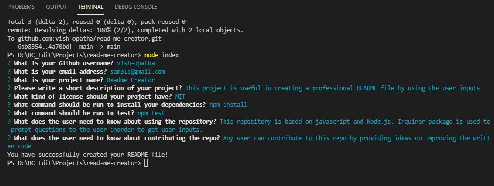

# Professional Readme Creator

  [](https://opensource.org/licenses/MIT)
     
  ## Description
  This simple command line application facilitates the user to create a professional Readme file according to his/her requirement. It saves a lot of time by generating the markdown syntax automatically, which otherwise need to be written manually by the user. 
  
  ## Table of Contents
  * [Installation](#Installation)
  * [Technical Work Done](#Technical-Work-Done)
  * [Questions](#Questions)
  
  ## Important Links
  Following are the important links related to this application.
  * [Professional README Creator - Github Repo](https://github.com/vish-opatha/read-me-creator/)
  * [Walkthrough Video](https://drive.google.com/file/d/1yA7MzbWLxi6El60amc_qyMcDRM3ogJHW/view?usp=sharing)

  ## Mock-up
  Following images shows the way of getting user inputs and the final README file that is created with the user inputs.

  

    

  ## Installation
  Before the user starts this application, user needs to install the necessary dependencies, and for that run the following command:

  ```
  npm install 
  ```
  ## Technical Acceptance Work Done
  This project is based on command line and the user is prompted with various types of questions by using the inquirer package. Those details are collected and handled by using Javascript and run using Node.js. Inquirer package is used to prompt the questions to the user in order to get the user inputs. There are a number questions prompted to the user,related to the repository to generate a strong professional README file. 

  With regrds to the project license, according to the user's selection the suitable license badge is selected. User's email and github profiles are linked at the end of the README, so that interested parties could reach the user for any querries they might have.

  ## Repository Quality Work Done
  1. Repository is named as read-me-creator.
  2. Tags are indented accordingly and comments are included while following the best practices for naming conventions.
  3. Changes were committed multiple times with messages.

  ## Questions
  If you have any questions about the repo, open an issue or directly contact me at <v.opatha@gmail.com> You can find my other work at [vish-opatha](https://github.com/vish-opatha)